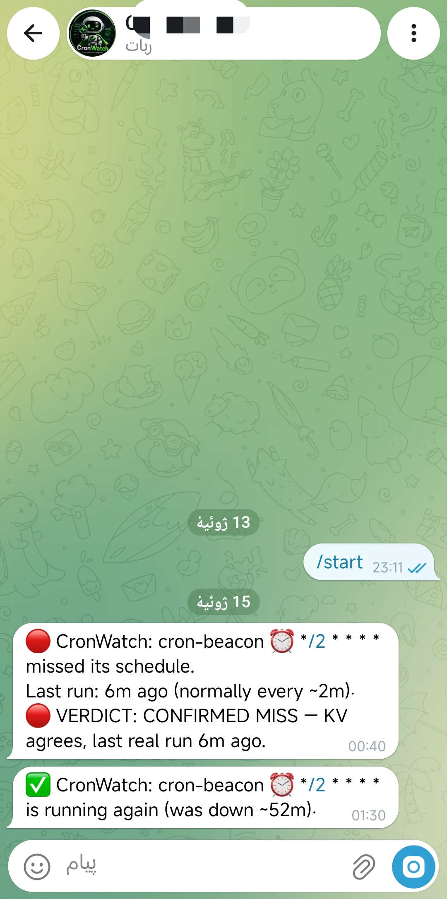

# CronWatch

**Cloudflare won't tell you when your cron dies. CronWatch will.**

A single-file Cloudflare Worker that monitors every cron trigger in your
account and sends you a Telegram alert when one goes silent — and a
recovery message when it comes back.

**Zero instrumentation.** No code changes, no ping URLs, no SDK. Your
existing Workers don't know CronWatch exists. It reads Cloudflare's own
Analytics data with a read-only API token.

## Why

Cloudflare cron triggers fail silently. A Worker can stop running —
deleted trigger, quota issue, broken deploy — and you find out days
later when the damage is done. Existing solutions (healthchecks.io,
Cronitor, etc.) require adding a ping call to every job. CronWatch
requires touching nothing.

## How it works

Every 5 minutes, CronWatch queries the official
`workersInvocationsScheduled` Analytics dataset — the same data behind
your dashboard's metrics. It learns each cron's normal interval from
its scheduled run times (median of the last 20 intervals, so one
outlier never skews it). When a cron is late beyond its learned
interval plus a safety buffer, you get a 🔴 alert. When it runs again,
you get a ✅ recovery message with the downtime. Failed runs (non-success
status) get a ⚠️ alert too.

It runs entirely on the Cloudflare free plan.

## Setup (~10 minutes, dashboard only — no CLI needed)

### 1. Create the API token
My Profile → API Tokens → Create Token → Custom token:
- Permission: **Account · Account Analytics · Read** — and nothing else.

This token can only read analytics. It cannot touch your Workers,
DNS, or anything else. That's the whole point.

### 2. Create a Telegram bot
- Talk to [@BotFather](https://t.me/BotFather) → `/newbot` → copy the token.
- Send your new bot any message, then open
  `https://api.telegram.org/bot<TOKEN>/getUpdates` and copy your
  `chat.id`.

### 3. Create the Worker
- Storage & Databases → KV → Create namespace → name: `CRONWATCH`
- Workers & Pages → Create Worker → name: `cronwatch` → paste
  [`cronwatch.js`](./cronwatch.js) → Deploy
- Settings → Bindings → KV Namespace:
  variable `CRONWATCH_KV` → namespace `CRONWATCH`
- Settings → Variables and Secrets:

| Name | Type | Value |
|---|---|---|
| `CF_API_TOKEN` | Secret | the token from step 1 |
| `CF_ACCOUNT_ID` | Text | Workers & Pages → overview, right sidebar |
| `TG_BOT_TOKEN` | Secret | from BotFather |
| `TG_CHAT_ID` | Text | from getUpdates |

- Settings → Triggers → Add Cron Trigger: `*/5 * * * *`

### 4. Verify
Open `https://<your-worker>.workers.dev/test` — you should get a
Telegram message. Then `/run` to force a first check, and `/status`
to see what it's watching.

## Configuration (all optional)

| Variable | Default | What it does |
|---|---|---|
| `WATCH` | *(all)* | comma-separated script names to watch |
| `EXCLUDE` | *(none)* | comma-separated script names to ignore |
| `WORKER_NAME` | `cronwatch` | **script name only** (not the URL). Set this if you named the Worker something else, so it doesn't monitor itself |
| `BUFFER_SECONDS` | `180` | grace on top of the learned interval. Auto-scales to 5% of the interval for infrequent crons, so a daily job isn't flagged for being 3 minutes late |
| `MIN_RUNS` | `3` | runs required before alerting is armed for a cron |
| `WINDOW_HOURS` | `6` | Analytics lookback per check. Does **not** need to exceed your longest cron interval — state persists in KV |

## FAQ

**Will it false-alarm?** Analytics data lags ~1–2 minutes behind
reality; the default 180s buffer absorbs that. Each cron alerts once
per outage (no spam every 5 minutes), and if many alerts fire at once
they're batched into a single digest message. If CronWatch can't reach
the Analytics API, it never fabricates a "missed schedule" alert — it
tells you monitoring is blind instead.

**New Worker not showing up?** Analytics reports freshly created
Workers under `__unknown__` for up to a few hours until the name
resolves. CronWatch skips these and picks the Worker up cleanly once
the real name appears.

**What about a cron that's supposed to run once a week?** Supported.
The learned-interval model doesn't care about the cron expression —
it learns from actual cadence. It just needs `MIN_RUNS` runs first.

## Built entirely on an Android phone

No laptop, no CLI. Written and deployed through the Cloudflare
dashboard from a phone. If I can ship it from a phone, you can
install it from anywhere.

---
MIT License
---

If CronWatch saved you from a silently dead cron, a ⭐ helps other
Cloudflare developers find it.
