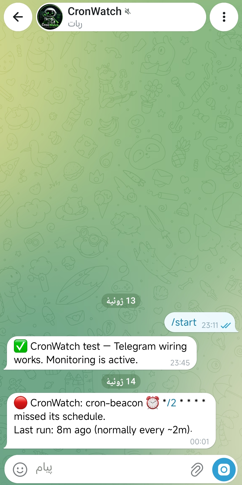
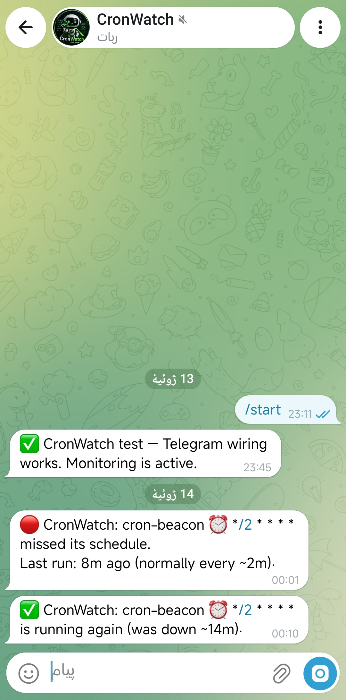

# CronWatch ⏰🔴

**Cloudflare won't tell you when your cron dies. This single-file Worker will.**

Zero-instrumentation cron monitoring for Cloudflare Workers. No changes to your existing Workers, no external services, no paid plan. Paste one file, add one read-only API token, get Telegram alerts when any cron trigger in your account silently stops running or fails.

## The problem

Cron Triggers on Cloudflare Workers fail silently. If a scheduled Worker stops running — a platform incident, a bad deploy, a quota issue — Cloudflare sends no email, no webhook, nothing. The dashboard only shows the last 100 events, minutes late, and only if you remember to look. If your nightly backup died two weeks ago, you find out the day you need the backup.

Existing monitors (Healthchecks.io, Cronitor, etc.) solve this by making you add a ping call inside every job. That means touching every Worker, and shipping your uptime data to a third party.

## How CronWatch is different

CronWatch reads Cloudflare's own Analytics (the `workersInvocationsScheduled` GraphQL dataset — cron runs only) from **inside your own account**:

- **Zero instrumentation** — your existing Workers are never modified. Not one line.
- **Zero config per cron** — it discovers every cron trigger in the account and learns each one's normal interval from observed history (median-based, robust to outliers).
- **Self-hosted, free** — runs as one Worker + one KV namespace on the free plan. Your data never leaves your account. The only external call is the alert to Telegram.
- **Alerts that behave** — one alert per incident (no spam), a ✅ recovery message with downtime estimate, a digest when many things break at once, and a warning if CronWatch itself loses access to Analytics ("monitoring is blind").

Detection latency: typically **5–10 minutes** after a missed schedule (Analytics ingest is ~1 minute; CronWatch checks every 5).

## Setup (~10 minutes, dashboard only — no CLI)

You need: a Cloudflare account (free is fine) and a Telegram account.

**1. Telegram bot**
- Message [@BotFather](https://t.me/BotFather) → `/newbot` → copy the **bot token**.
- Open your new bot, send it any message (this authorizes it to message you).
- Get your **chat id**: open `https://api.telegram.org/bot<TOKEN>/getUpdates` in a browser and find `"chat":{"id":...}` — or just ask [@userinfobot](https://t.me/userinfobot).

**2. API token**
- Cloudflare dashboard → My Profile → API Tokens → Create Token → **Create Custom Token**.
- One permission only: **Account → Account Analytics → Read**. Copy the token.

**3. KV namespace**
- Storage & Databases → KV → Create namespace → name it `CRONWATCH`.

**4. The Worker**
- Workers & Pages → Create Worker → name `cronwatch` → Deploy → Edit code → replace everything with [`cronwatch.js`](./cronwatch.js) → Deploy.
- Settings → **Bindings** → Add → KV Namespace → variable name exactly `CRONWATCH_KV` → select the `CRONWATCH` namespace.
- Settings → **Variables and Secrets**:

| Name | Value | Type |
|---|---|---|
| `CF_API_TOKEN` | token from step 2 | Secret |
| `CF_ACCOUNT_ID` | dashboard → Workers & Pages → Account details | Text |
| `TG_BOT_TOKEN` | token from step 1 | Secret |
| `TG_CHAT_ID` | your chat id | Text |

- Settings → **Triggers** → Add Cron Trigger → `*/5 * * * *`.

**5. Verify**
- Open `https://<your-worker-url>/test` → you should receive a Telegram message.
- Open `/run` (first check), then `/status` → your crons appear with their learned intervals.

## Endpoints

| Path | What it does |
|---|---|
| `/status` | JSON: everything being watched, learned intervals, time until alert |
| `/test` | Sends a test Telegram message |
| `/run` | Runs a check immediately (useful right after install) |

## Optional configuration (env vars)

| Var | Default | Meaning |
|---|---|---|
| `BUFFER_SECONDS` | `180` | Safety margin over the learned interval before alerting. Auto-scales to 5% of the interval for infrequent crons, so a daily job isn't flagged for being 3 minutes late. |
| `MIN_RUNS` | `3` | Grace: runs observed before a cron is armed. Prevents false alarms on brand-new crons. |
| `WINDOW_HOURS` | `6` | Analytics lookback per check. Does **not** need to exceed your longest cron interval — state persists in KV and checks run every 5 minutes, so every run lands in many overlapping windows. |

## Good to know

- **New Workers take a while to get a name in Analytics** (observed: up to ~3 hours — they show as `__unknown__` until then). The grace period keeps CronWatch quiet during this; a brand-new cron is armed after its first few runs.
- **Infrequent crons arm slowly by design**: a daily cron needs ~3 days of history before monitoring starts. That's the price of zero configuration.
- **Very high-volume accounts**: the Analytics query is capped at 1000 rows per check. Normal accounts never get close; if you run thousands of cron invocations per 6 hours, open an issue — pagination is on the roadmap.
- **Cost**: ~288 checks/day = one GraphQL query + one KV read/write each. Comfortably inside the free plan for both Workers and KV, and under 1% of the Analytics API rate limit.

## How the detection works (short version)

For every `(worker, cron expression)` pair seen in Analytics, CronWatch keeps the last 20 gaps between *scheduled* run times and takes the median. If `now − last run > median + buffer`, you get a 🔴 alert — once. When the cron runs again, you get a ✅ with the estimated downtime. Runs with a non-`success` status trigger a ⚠️ failure alert. That's the whole trick: Cloudflare already has the data; it just never looks at it for you.

## License

MIT

---

*Built entirely from an Android phone using the Cloudflare dashboard. If CronWatch caught a dead cron for you, a ⭐ helps others find it.*
